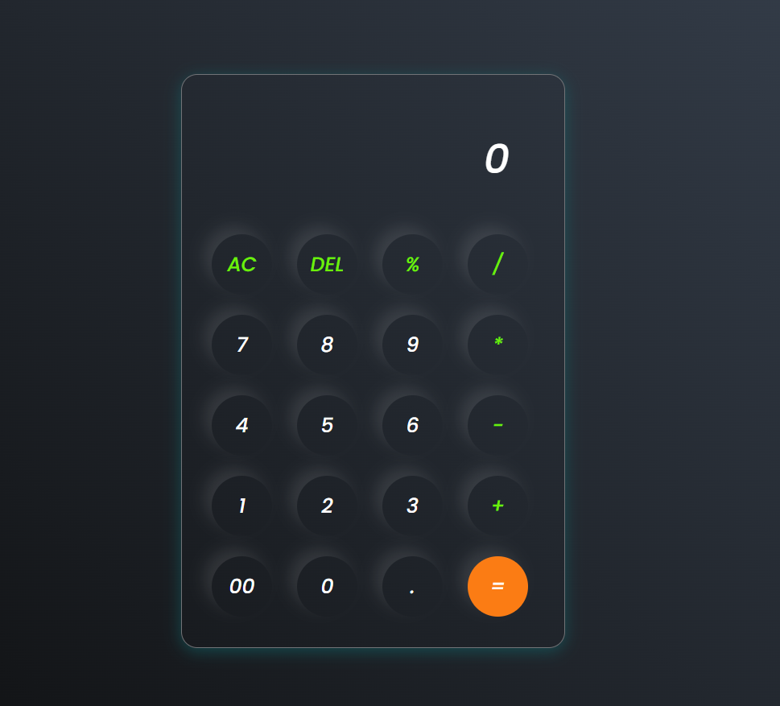

# Calculator
## Overview

This is a calculator app with many functionalities including addition, subtraction, multiplication, and division.

## Features

- Addition
- Subtraction
- Multiplication
- Division

## Interface

## How to Use

1. Clone the repository.
2. Open the `index.html` file in your browser.
3. Use the buttons on the interface to perform calculations.

## Technologies Used

- HTML
- CSS
- JavaScript

## License

This project is licensed under the MIT License.